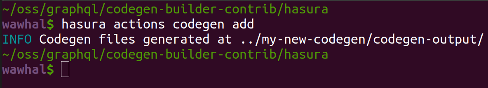
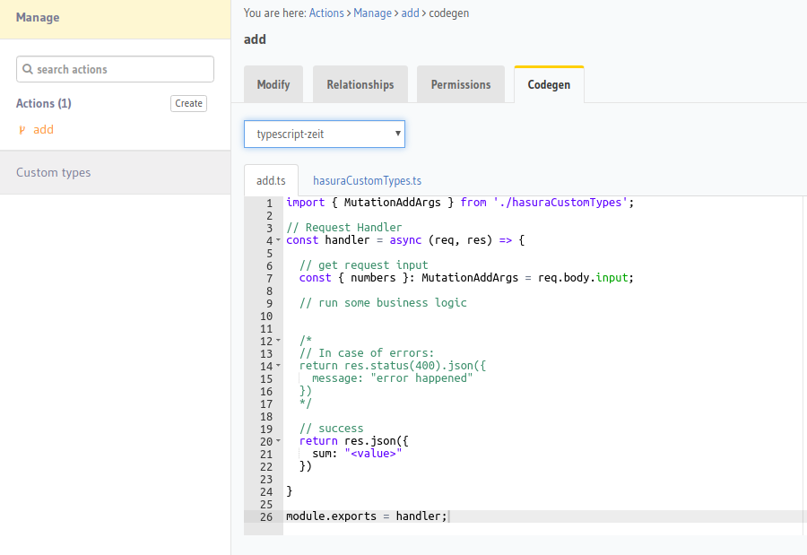

# codegen-builder-contrib

A repo and tutorial to help build new codegens for Hasura (CLI and console).

## Introduction

Currently, the Hasura CLI and console only do codegen for actions. This is roughly how actions codegen works:

1. `hasura actions codegen <action-name>` or the codegen tab on the console will invoke the codegen

	  CLI                                     |  Console
	  :--------------------------------------:|:------------------------------------------:
	    |  

2. This will invoke the codegen that was set in the `config.yaml` for the CLI, or the user selected dropdown in the console
3. Every actions codegen script accepts arguments:
  - `action-name`: The name of the action that you wish to codegen
  - `actions-sdl`: All the actions and custom types definition in [GraphQL SDL](https://alligator.io/graphql/graphql-sdl/)
  - `derive-payload`: When you derive an action from a Hasura mutation, this payload will be sent. In case of non-derived actions, this is `null`.

    The actions codegen script should return an array of files where file is a JSON object of the following format:

	  ```json
	  {
	    "name": "<filename>.<extension>",
	    "content": "<file content>"
	  }
	  ```

4. Example:

	  ```js
	  const templater = (actionName, actionsSdl, derive) => {

	    // your codegen logic

	    return [
	      {
	        name: "file1.js",
		content: 'console.log("This is an autogenerated file")'
	      },
	      {
	      	name: "file2.js",
		content: 'console.log("This is another autogenerated file")'
	      }
	    ]
	  }
	  ```
5. The hasura CLI or console then print the files in the directory or render the files and contents in the console UI respectively

## Getting started

1. Clone this repo
    ```
    git clone git@github.com:hasura/codegen-builder-contrib
    cd codegen-builder-contrib
    ```
2. Run Hasura & Postgres and update the `endpoint` in `hasura/config.yaml` with the Hasura endpoint (eg: `https://your-app.herokuapp.com` or `http://localhost:8080`).
3. Get the appropriate Hasura CLI binary for your operating system from the `bin` directory of this repo.

## Load the initial schema and metadata to prepare for development

There are a few tables and actions already defined. Load them up:
1. `cd hasura`
2. `hasura migrate apply`
3. `hasura metadata apply`

## Run the sample codegen

We have setup a basic codegen (`actions-codegen.js`) in the `my-new-codegen` directory. To try it out:

1. Run `hasura actions codegen add`
2. You should see a `my-new-codegen/codegen-output/file1.md` and a `my-new-codegen/codegen-output/file2.md`.

This codegen uses a Javascript script that is present in `my-new-codegen/actions-codegen.js`

## Start playing with the `actions-codegen.js` script

Open up the `my-new-codegen/actions-codegen.js` file and start building your own codegen!

For reference, [check these codegen for `nodejs-zeit`](https://github.com/wawhal/actions-codegen/blob/master/nodejs-zeit/codegen.js).

Limitations:
- Because the codegen script is loaded dynamically, avoid loading external depedencies.
- These are the libraries that are currently available that you can `require()` in your codegen script:
  - graphql
  - @graphql-codegen/core
  - inflection
- Codegen scripts support ES6 (use `require` for loading dependencies instead of `import`)

## Publish your codegen for everyone so that it shows up in the CLI and the console

TODO FIXME